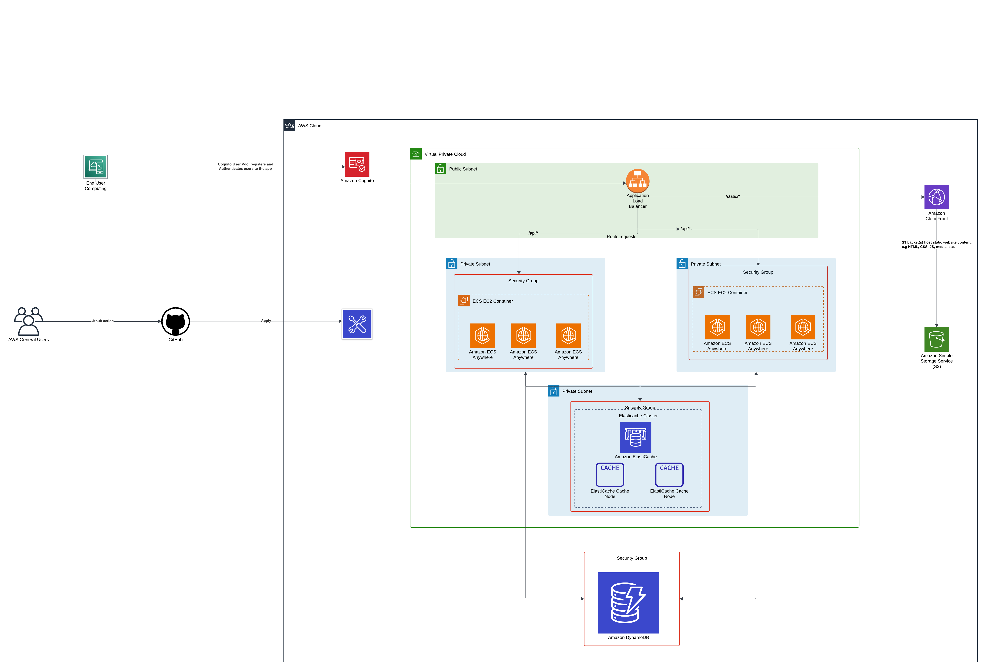

# Architecture Flow

1. User Request Flow 
- The user accesses the frontend (hosted in S3 and served via CloudFront).

2. Frontend (S3 + CloudFront)
- The frontend, including HTML, CSS, JavaScript, and images, is stored in S3.
- CloudFront is used to deliver these assets globally with low latency and over HTTPS.

3. Application LoadBalancer
- ALB forwards the request to the appropriate ECS service (the backend).

4. Backend (ECS + DynamoDB)
- ECS are deployed on Amazon ECS using either Fargate (serverless) or EC2 (containerized).
- DynamoDB will serve as the primary database for scalable, low-latency data storage.

5. ElastiCache
- ECS queries DynamoDB for persistent data.
- Frequently accessed data can be cached in ElastiCache to reduce latency.
- ElastiCache can also be used to store session states or manage queues, further improving system performance and scalability.

